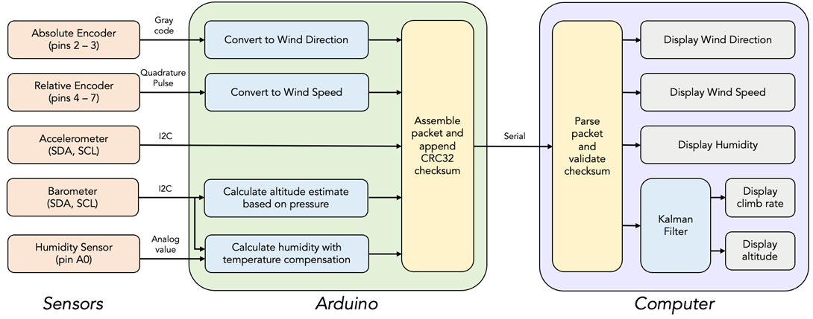
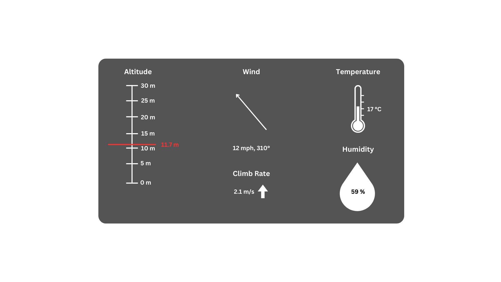

<h1>SF4 Project</h1>

Repository to house software for the SF4: Data Logger project.

Team: Christopher Li and Sunaabh Trivedi

<h2> Project Details </h2>

A weather balloon telemetry system with altitude, humidity, temperature and wind direction/speed measurements.

The altitude is measured through a combination of barometric pressure (BMP388) and three-axis accelerometer (SEN0409) sensors, fused with a Kalman Filter. 
Humidity is measured through an analog humidity sensor (HCZ-D5-A), and temperature through the BMP388 sensor.
Wind speed and direction are measured via rotary encoders.

The measured sensor readings are then sent over a serial link to a computer, where the processing is done (Kalman filter), as well as the UI presentation.

<h2> Data Rate and Format </h2>

The sampling frequency will be 50 Hz, and data will be sent as 26-byte packets with a checksum. This results in a bit rate of 10400, allowing us to transmit at a baud rate of 19200 or 38400 bits/s.

<h2> Data Processing </h2>

<h2> User Interface </h2>

A simple user interface is used to display the weather data.

